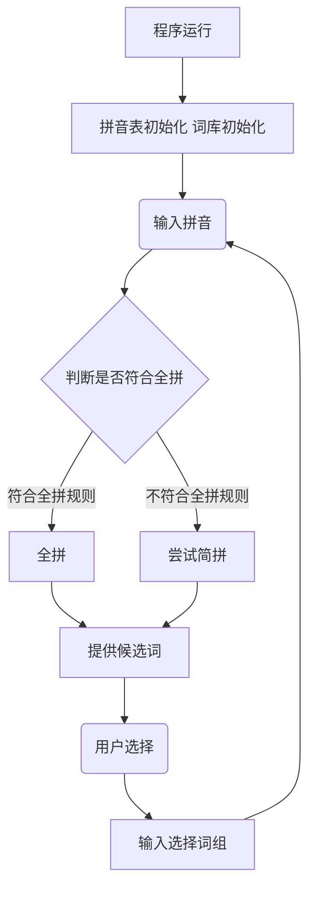

# pinyin-IME 自带词库、支持用户词库、支持简拼的拼音输入法

## 需求概述

程序实现一个自带词库、支持用户词库、支持简拼的中文汉字输入法。

### 需求细分

- 能够输入拼音
- 能够输入带音节分隔的拼音
- 能够正确地处理拼音分词
- 能够提供候选词供用户选择
- 能够记录词典和词频
- 能够根据词频对候选词排序
- 能够实现词库的扩充
- 能够实现首字母简拼

## 业务逻辑



程序设计上，循环地运行，可以多次拼写

在运行途中，用户可以随时选择中断拼写或者退出程序

## 架构设计

### 源文件

#### `txt2data.cpp`

##### `void word2pinyin(wstring word, int cur_position, string pinyin_string)`

类DFS的方式将任意长度的汉字词语转换成若干个（考虑多音字的可能）带音节分隔的拼音字母串，并存入`map<string, vector<wstring>> pinyin_to_words`

如”大学“一词，在其他函数中进行调用`word2pinyin(L"大学", 0, "")`会在`pinyin_to_words`中增加`<"da'xue", L"大学">`和`<"dai'xue", L"大学">`两条记录

##### `void txt2data()`

用于初始化语料，从包含噪声的语料文本中提取词组生成词典

设计上，只有在同目录没有找到`dicitonary.data`时才调用`txt2data()`进行全新地初始化

原始的语料文本包含许多噪声，包括但不限于：

- 各种特殊符号
- 英文字母字词
- 各种标点符号
- 繁体字

本函数在读入语料的同时判断是否为噪声

使用`wifstream fin("data.txt", ios::in)`从语料文本`data.txt`中找词

使用`wofstream fout("dictionary.data", ios::out)`立即将词典保存到`dictionary.data`

##### `wstring string2wstring(string str)`

将`string`类型的字符串转换成`wstring`的宽字符串以供宽字符文件流输出

#### `main.cpp`

`main.cpp`实现了输入法的大多数操作，如处理输入，找词，输出，保存词库等

##### `void pinyin2data()`

用于程序运行之初，从`pinyin.txt`中读入音节及其对应的汉字

##### `string wstring2string(wstring wstr)`

用于将`wstring`宽字符串转换为`string`

##### `void dictionary_input(wifstream &fin)`

当`dictionary.data`存在时，调用函数以初始化词典

##### `bool words_compare(const wstring& a, const wstring& b)`

函数实现了两个宽字符串（即两个汉字词语）的大小比较以实现排序，排序原则为词频更高的优先，同词频下长度更长的优先（有利于减少用户选词的次数）

##### `void save_dictionary()`

在用户选择退出后，将有变动的词典保存到资源文件`dictionary.data`

##### `int main()`

主要的程序主体

1. 调用`pinyin2data()`初始化拼音
2. 尝试开启`dictionary.data`文件流，存在则快速初始化，不存在则调用`txt2data()`全新初始化
3. 输入拼音
4. 给出候选词
5. 输出拼写结果
6. 反复执行3 4 5步直到用户选择退出

### 资源文件

#### `pinyin.txt`

预置的、必要的拼音数据文件，用于建立单个汉字与其拼音的对应

#### `data.txt`

未经处理的语料，包含许多噪声

噪声类型包括但不限于：

- 各种特殊符号
- 英文字母字词
- 各种标点符号
- 繁体字

#### `dictionary.data`

经程序处理过的词典文件，当`dictionary.data`存在就不需要从`data.txt`初始化

文件主要保存带分隔的拼音串和其对应的若干词语及词语的词频

```
//用'分隔音节的拼音串[空格]对应的词语数[空格]第一个词语[空格]第一个词语的词频[空格]第二个词语......
dong'dao  4  东道 24  动刀 5  东到 16  懂到 1  
```

### 数据结构

项目中大量使用到宽字符`wchar_t`和宽字符串`wstring`。宽字符使得单个汉字占1个存储空间（而不是在`string`中占2个空间，代码书写不便，运行调试不便），可以像处理单个字母一样方便地处理汉字。宽字符串相比字符串更适合处理汉字。

未分隔的拼音串用`string`存储，如`string pinyin = "shulikou"`

将未分隔的拼音串根据拼音表分隔后得到`string`类型的拼音串，用'进行分隔，如`string yinjie = "shu'li'kou"`

对于可能产生歧义的音节，如`xian`，在用户未手动分隔为`xi'an`（西安）时会优先按长音节处理为`xian`（先）

为了建立数据之间的“对应”关系，使用了`map`

用`map<string, vector<wchar_t>> pinyin`存储音和汉字们的对应，用`vector<wchar_t>`存储若干汉字

用`map<string, vector<wstring>> pinyin_to_words`存储带分隔的拼音串和词语们的对应，用`vector<wstring>`存储若干词语

用`map<wstring, long long> dictionary`作为带词频的词典，每个汉字词语对应其词频（用一个长整型`long long`表示）

程序中对候选词的排序使用`<algorithm>`中的快排`sort()`

## 项目难点

1. 即使使用`wchar_t`处理汉字，1个汉字还是会被分成2个位置存储，没法进行处理

设置locale("chs")`在中国，实现标准控制台正常输入输出

文件流设置`file_stream.imbue(locale("chs"))`实现文件正常输入输出

2. 难以分辨串中某个字符是不是简体汉字

先`setlocale(LC_ALL, "chs")`设为大陆简体中文。然后直接调用`iswupper()` `iswlower()` `iswdigit()` `iswpunct()` `iswspace()`判断是否是大小写字母、数字、（含当前时区下的广义的）标点、空格，再找该字符是否存在至少一个对应的拼音（筛去繁体字）。

